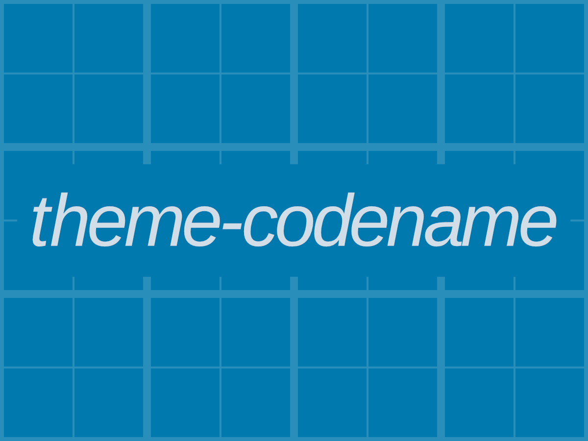

# Theme codename child theme

A child theme for my WordPress starter theme.

It uses [Bootswatch](https://bootswatch.com/) free themes for Bootstrap.

##### Parent theme here: https://github.com/loltgt/theme

#### Documentation

Read the documentation here: https://github.com/loltgt/theme/wiki/Classes-theme-Child

#### Requirements

* WordPress >= 4.6
* PHP >= 7
* [Composer](https://getcomposer.org/)
* [Node.js](https://nodejs.org/)

### How to contribute

You can open issues to report bug, request features or send a Pull Request.

### License

[GPL-2.0-or-later](LICENSE)

Some contents in "src" folder are dual licensed (MIT OR GPL-2.0-or-later).
